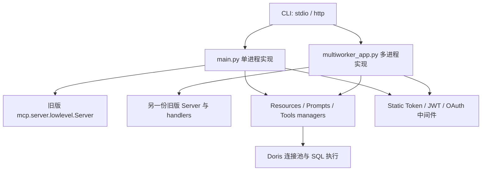
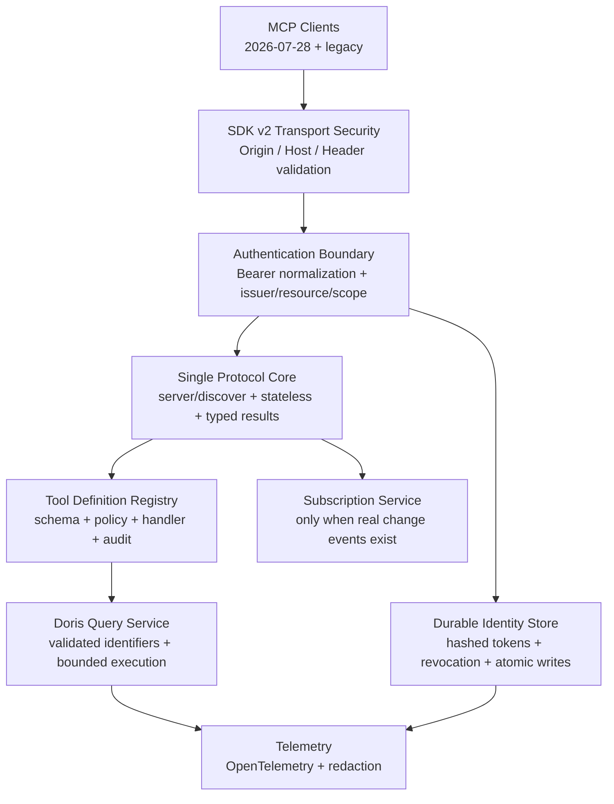

# Apache Doris MCP Server 对 MCP 2026-07-28 的完整审计报告

> 审计日期：2026-07-29
> 审计对象：`apache/doris-mcp-server`
> 仓库基线：`0e843ae3432115ea5895fbd90a97d495c77f911c`（`master`，2026-06-11）
> 协议基线：MCP `2026-07-28`，规范提交 `5f5440bb26a62e2cf3440b92da5a667efa03b267`
> Python SDK 基线：`mcp` `v2.0.0`，提交 `6f69a3758ebf2ee55ce050f58b470ce11af71133`

## 一、执行摘要

### 1. 最终判断

当前 Doris MCP Server **不兼容 MCP 2026-07-28**。这不是“缺少少数新增能力”，而是协议生命周期、传输语义、消息结构、错误模型和鉴权边界都仍停留在旧协议。

更严重的是，真实 HTTP 探针证明：

1. 服务器要求旧版 `Mcp-Session-Id`，无法接受新版无会话请求；
2. 合法的新版 `server/discover` 请求进入旧 SDK 后，会产生未捕获的协议解析异常；
3. 请求返回 HTTP 500 后，服务进程随 AnyIO `TaskGroup` 一起退出；
4. 后续 `/health` 也无法连接。

因此，当前版本面对会主动探测 2026-07-28 的新客户端时，不只是“协商失败”，而是存在**远程拒绝服务风险**。

### 2. 发布建议

在完成迁移和验收前：

- 不应宣称支持 MCP 2026-07-28；
- 不应把当前 HTTP 模式作为面向公网或不可信网络的生产服务发布；
- 不应继续以“production-ready”“100%”等措辞描述当前质量门禁；
- 可以继续将现版本定位为旧协议兼容版，但必须限定支持范围，并先修复异常请求导致进程退出、默认凭证、CORS 和查询参数令牌问题。

### 3. 风险概览

本报告的 P0/P1/P2 表示修复与发布优先级，不等同于 CVSS 定级。

| 等级 | 数量 | 代表性问题 |
|---|---:|---|
| P0 / 发布阻断 | 4 | 新版合法请求可导致进程退出；完全不支持 2026-07-28；任意 Origin + 凭证式 CORS；已知固定默认令牌与默认匿名访问组合 |
| P1 / 高优先级 | 10 | OAuth audience/resource 边界、外部 OAuth Bearer 链路断裂、错误被包装成成功、明文令牌多进程写入、健康检查失真、客户端包入口损坏、无 CI/一致性门禁 |
| P2 / 中优先级 | 10 | 重复架构、类型和 lint 债务、部署配置冲突、依赖分层、文档漂移、时间 API 弃用等 |

### 4. 已有优点

本报告不是对项目已有工作的否定。当前代码有几项值得保留的基础：

- Doris OAuth 已实现 PKCE S256、受保护资源元数据、scope、刷新令牌轮换、吊销和速率限制等机制；
- SQL 安全单元测试本次为 `31 passed`；
- OAuth/鉴权策略聚焦测试本次为 `97 passed`；
- 当前 `0.6.1` 已不在 CVE-2025-66335 的已知受影响版本范围内；
- Dockerfile 使用非 root 用户；
- 工具列表当前由固定顺序构造，满足新版“确定性顺序”的方向；
- 包可构建，锁文件可校验。

问题主要在于：这些能力尚未被一个可靠的协议核心、鉴权边界和持续质量门禁统一起来。

---

## 二、审计范围、方法与限制

### 1. 审计范围

本次覆盖：

- MCP 2026-07-28 官方规范、Schema、变更日志、弃用清单；
- 官方 Python SDK `v2.0.0` 和迁移指南；
- 官方 MCP Conformance Suite 的服务端无状态场景；
- 当前仓库的协议入口、STDIO、Streamable HTTP、多进程模式；
- tools、resources、prompts、错误语义和缓存语义；
- 静态令牌、JWT、外部 OAuth、Doris OAuth；
- 数据库访问和 SQL 安全边界；
- 配置、Docker、打包、测试、lint、类型检查和文档；
- 实际构建、实际启动和 HTTP 协议探针。

### 2. 证据原则

结论分为三类：

- **已验证**：由本地测试、构建、静态工具或真实 HTTP 请求复现；
- **代码确认**：由当前提交中的明确控制流确认；
- **待运行环境验证**：需要真实 Doris、Redis、代理或浏览器环境才能最终确认。

### 3. 限制

- 本次没有可用的真实 Doris 集群，因此没有验证真实查询正确性、性能、FE/BE 故障恢复和 Doris 权限映射；
- 官方 Conformance npm 包在本机拉取时没有返回，未能完成官方套件执行；已使用精确 Schema 对照和真实线级探针补充验证；
- Bandit 的 B608 等结果是审计线索，不等同于已证明存在 SQL 注入；
- 本报告没有修改业务代码，只新增审计报告。

---

## 三、MCP 2026-07-28 到底改变了什么

官方资料：

- [MCP 2026-07-28 规范](https://modelcontextprotocol.io/specification/2026-07-28)
- [2026-07-28 变更日志](https://modelcontextprotocol.io/specification/2026-07-28/changelog)
- [规范正式 Release](https://github.com/modelcontextprotocol/modelcontextprotocol/releases/tag/2026-07-28)
- [Streamable HTTP 传输规范](https://modelcontextprotocol.io/specification/2026-07-28/basic/transports/streamable-http)
- [授权规范](https://modelcontextprotocol.io/specification/2026-07-28/basic/authorization)
- [授权安全注意事项](https://modelcontextprotocol.io/specification/2026-07-28/basic/authorization/security-considerations)
- [Python SDK v2.0.0](https://github.com/modelcontextprotocol/python-sdk/releases/tag/v2.0.0)
- [Python SDK v2 迁移指南](https://github.com/modelcontextprotocol/python-sdk/blob/main/docs/migration.md)
- [官方 Conformance Suite](https://github.com/modelcontextprotocol/conformance)

### 1. 九项主变化

| 变化 | 2025-11-25 及以前 | 2026-07-28 |
|---|---|---|
| 会话 | HTTP 可使用 `Mcp-Session-Id` | 删除协议级会话和该 Header |
| 初始化 | `initialize` + `notifications/initialized` | 删除握手；每个请求自描述 |
| 请求元数据 | 初始化时协商 | 每个请求 `_meta` 必须带协议版本和客户端能力 |
| 服务发现 | 无统一前置发现 | 服务器必须实现 `server/discover` |
| 服务端通知 | GET/SSE、资源订阅等多种路径 | 统一为长 POST `subscriptions/listen` |
| 工具性 RPC | `ping`、`logging/setLevel` 等 | 删除；日志级别改为请求级 `_meta` |
| Tasks | 核心实验能力 | 移出核心，成为 `io.modelcontextprotocol/tasks` 扩展 |
| 服务端反向请求 | roots/sampling/elicitation 由服务端发起 | 改为 MRTR：`InputRequiredResult` + 原请求重试 |
| 结果与恢复 | 普通结果无统一类型，SSE 可恢复 | 所有结果有 `resultType`；删除 Last-Event-ID 重放 |

### 2. 每个请求必须携带的新版元数据

新版请求 `_meta` 的关键字段是完整命名空间键：

```json
{
  "_meta": {
    "io.modelcontextprotocol/protocolVersion": "2026-07-28",
    "io.modelcontextprotocol/clientCapabilities": {},
    "io.modelcontextprotocol/clientInfo": {
      "name": "example-client",
      "version": "1.0.0"
    }
  }
}
```

前两个字段为必需；`clientInfo` 为 SHOULD。HTTP 中 `_meta` 协议版本必须与 `MCP-Protocol-Version` Header 一致。

### 3. 新版服务端必须处理的基础语义

- 必须实现 `server/discover`；
- 普通结果必须包含 `resultType: "complete"`；
- 需要客户端补充信息时返回 `resultType: "input_required"`；
- HTTP POST 必须校验 `Mcp-Method`，带名称的请求还要校验 `Mcp-Name`；
- Header 与请求体不匹配返回 `HeaderMismatch` `-32020`；
- 缺少必要客户端能力返回 `-32021`；
- 不支持协议版本返回 `-32022`，并告知支持版本；
- `tools/list`、`prompts/list`、`resources/list`、`resources/read`、`resources/templates/list` 等可缓存结果必须带 `ttlMs` 和 `cacheScope`；
- tools 应保持确定性顺序；
- JSON Schema 按 2020-12 完整关键字处理，并限制 `$ref`、组合关键字带来的资源消耗。

### 4. 授权侧变化

- 授权服务器 SHOULD 在授权响应中返回 RFC 9207 `iss`；
- 客户端看到 `iss` 后必须与记录的 issuer 比对；
- Dynamic Client Registration 的 MCP 客户端必须提供适当的 `application_type`；
- 客户端凭证必须按 authorization server issuer 隔离；
- DCR 已进入弃用路径，新实现应优先 Client ID Metadata Documents；
- Bearer token 不得放进 URI query；
- Resource Server 不得接受不是为自己签发的 access token。

### 5. 官方 Python SDK v2 的直接影响

当前项目使用低层 `Server` API，因此迁移不是只改依赖版本：

- 旧低层装饰器被移除，改为构造器 `on_*` handlers；
- handler 接收 `(ctx, params)`；
- handler 返回完整协议 Result 类型；
- 字段名改为 Python `snake_case`；
- SDK 不再自动替应用包装结果；
- handler 抛异常不会再自动变成工具的 `isError: true`；
- 推荐用统一高层 `MCPServer`，或按 v2 低层 API 显式实现错误和结果语义；
- v2 Streamable HTTP 可在同一实现中处理新版无状态请求和旧版握手兼容。

---

## 四、当前项目基线

### 1. 仓库状态

```text
branch: master
HEAD:   0e843ae3432115ea5895fbd90a97d495c77f911c
pull:   Already up to date
```

仓库没有 `.codegraph/`，因此本次按普通源码审计执行。

### 2. 依赖和协议版本

- 项目版本：`0.6.1`；
- Python：`>=3.12`；
- 声明依赖：`mcp>=1.8.0,<2.0.0`；
- 锁定版本：`mcp==1.9.3`；
- 运行时旧服务器协商到：`2025-03-26`；
- 官方支持 2026-07-28 的 Python SDK：`2.0.0`。

结论：依赖约束明确排除了实现新协议的 SDK 主版本。

### 3. 当前协议结构



单进程和多进程入口各自复制了服务器构造、协议 handlers、鉴权和 ASGI 组装。两者已经发生行为漂移：单进程 `stateless=False`，多进程 `stateless=True`，但两者都仍是 SDK 1.9 的旧协议实现。

---

## 五、MCP 2026-07-28 逐项符合性矩阵

| 检查项 | 规范要求 | 当前状态 | 判定 |
|---|---|---|---|
| `server/discover` | MUST | 没有实现；合法请求可导致进程退出 | ❌ P0 |
| 无协议会话 | 删除 `Mcp-Session-Id` | 单进程强制旧会话；多进程仍由旧 SDK 处理 | ❌ |
| 删除初始化握手 | 每个请求自描述 | 仍依赖 `initialize`/`initialized` | ❌ |
| 请求 `_meta` | 版本、客户端能力必需 | 无新版元数据解析/验证 | ❌ |
| Result `_meta` | serverInfo SHOULD | 无 | ❌ |
| `resultType` | 所有结果必需 | 全仓未实现 | ❌ |
| `Mcp-Method` / `Mcp-Name` | HTTP POST 必须校验 | 未实现 | ❌ |
| 标准协议错误 | `-32020/-32021/-32022` | 未实现 | ❌ |
| `subscriptions/listen` | 新通知统一入口 | 未实现；仍保留 GET 兼容路径 | ❌ |
| HTTP GET | 新版已移除 | 仍主动改写/兼容 GET | ❌ |
| SSE resumability | 已移除 | 由旧 transport 语义主导 | ❌ |
| 缓存提示 | 指定结果必须有 `ttlMs/cacheScope` | 未实现 | ❌ |
| tools 顺序 | SHOULD 确定 | 手工固定列表 | ✅ |
| MRTR | 需要客户端输入时采用 | 未实现；当前业务暂未依赖 | ⚠️ |
| Tasks 扩展 | 核心已移除 | 当前未实现 Tasks | ✅ N/A |
| JSON Schema 2020-12 | 完整关键字和资源边界 | 手工 schema，未见系统验证和资源上限 | ⚠️ |
| DCR `application_type` | 客户端必须提供，服务端应校验 | 注册实现未校验/持久化 | ❌ |
| 授权响应 `iss` | AS SHOULD 返回 | 未返回 | ❌ |
| audience/resource | 只接受为本 RS 签发的 token | Doris OAuth 存在 resource 校验缺口；外部 OAuth 依赖 userinfo | ❌ |
| Bearer query | MUST NOT | 多条链路接受 query token | ❌ |
| Origin 防护 | 必须校验，防 DNS rebinding | 任意 Origin 被反射并允许 credentials | ❌ P0 |
| 旧版兼容 | 可兼容早期客户端 | `2025-03-26` 初始化可成功 | ✅ 有限 |

---

## 六、关键缺陷详解

### P0-1：合法新版请求可让 HTTP 服务进程退出

**状态：已验证。**

复现流程：

1. 启动当前 HTTP 服务；
2. 旧版 `initialize` 成功，返回 `protocolVersion: 2025-03-26`；
3. 发送符合 2026-07-28 结构的 `server/discover`；
4. 服务器返回 HTTP 500：`No response received`；
5. 旧 SDK 对未知请求产生多分支 Pydantic `ValidationError`；
6. 异常穿透 AnyIO `TaskGroup`，Uvicorn 进程退出；
7. 再访问 `/health`，连接失败。

在没有旧会话 ID 时，同一新版请求先返回 HTTP 400 “Missing session ID”，响应仍下发 `mcp-session-id`。这同时证明传输层仍以旧会话为核心。

**影响：**

- 默认匿名 HTTP 服务只要网络可达即可触发；
- 开启鉴权后，任意合法客户端凭证持有者仍可能触发；
- 新客户端的正常兼容性探测本身就可能造成服务中断；
- 健康检查和进程编排会进入重启循环。

**修复要求：**

- 首选直接迁移 SDK v2，让 `server/discover` 由新版协议栈处理；
- 在迁移完成前，协议解析失败必须被请求边界捕获，不能终止 ASGI lifespan；
- 对未知方法返回 JSON-RPC `Method not found`，而不是传播模型解析异常；
- 加一条回归测试：任意未知或新版方法都不得影响下一次 `/health` 和 `tools/list`。

### P0-2：协议核心完全不具备 2026-07-28 互操作性

**状态：代码确认 + 真实探针验证。**

主要证据：

- [`pyproject.toml`](./pyproject.toml) 明确限制 `mcp<2.0.0`；
- [`main.py`](./doris_mcp_server/main.py) 使用旧版低层装饰器和 `InitializationOptions`；
- 单进程 HTTP 使用 `stateless=False`；
- 多进程的 `stateless=True` 只是 SDK 1.9 的传输配置，并不会自动实现 2026-07-28；
- 代码中没有 `server/discover`、新版 `_meta`、`resultType`、`subscriptions/listen`、`ttlMs`、`cacheScope`、MRTR 和新版错误码。

**影响：**

- 新客户端无法使用；
- 协议协商、缓存、安全代理、通知和错误处理均不符合最新版；
- 继续在旧低层 API 上补丁式兼容，会扩大下一轮迁移成本。

**修复要求：**

- 升级 `mcp>=2.0,<3.0`；
- 采用 SDK v2 高层 `MCPServer`，或完整迁移低层 `on_*` handlers；
- 以新版无状态路径为主，利用 SDK 的旧版兼容能力保留现有客户端；
- 删除所有依赖 SDK 私有实现的 monkey patch。

### P0-3：Origin/CORS 允许不可信网页携带凭证调用 MCP

**状态：已验证。**

当前 [`mcp_cors.py`](./doris_mcp_server/auth/mcp_cors.py) 会反射任意 Origin；两个 ASGI 入口还配置了：

```python
allow_origins=["*"]
allow_credentials=True
```

真实预检请求：

```text
Origin: https://evil.example
```

得到：

```text
Access-Control-Allow-Origin: https://evil.example
Access-Control-Allow-Credentials: true
```

同时允许 `Authorization`、`content-type` 和 MCP 会话 Header。

**影响：**

- 违反 Streamable HTTP 对 Origin 校验和 DNS rebinding 防护的要求；
- 浏览器存在可用凭证时，恶意页面可能跨源调用 MCP；
- 配合监听 `0.0.0.0`、弱/固定令牌或本地代理，会把本地数据库能力暴露给网页。

**修复要求：**

- 默认只绑定 `127.0.0.1`；
- 默认拒绝所有跨域 Origin；
- 显式 allowlist，且只允许可信 HTTPS Origin；
- 不需要浏览器凭证时关闭 `allow_credentials`；
- 使用 SDK v2 的 transport security / DNS rebinding 防护；
- 测试 `Origin: null`、攻击域、同源、伪造 Host 和反向代理场景。

### P0-4：固定默认令牌、默认匿名访问和数据库工具形成危险组合

**状态：代码确认。**

当前存在：

- 鉴权功能默认全部关闭，启动日志明确提示匿名访问；
- [`token_manager.py`](./doris_mcp_server/auth/token_manager.py) 内置可预测的 admin/analyst/readonly 固定令牌；
- 仓库跟踪的 `tokens.json` 保存令牌记录；
- legacy 配置存在 `default_secret`；
- README 直接展示固定默认令牌；
- 文档大量使用 `0.0.0.0` 部署方式。

即使单项是为了本地快速体验，组合后仍会形成生产误配置陷阱。

**修复要求：**

- 删除全部可工作的默认令牌和默认 secret；
- 首次启用静态令牌模式时强制显式配置高熵密钥；
- 非 loopback 地址启动且无鉴权时直接拒绝启动，除非显式危险开关；
- `tokens.json` 只能作为无凭证模板，不能包含可用 token；
- 文档把匿名模式标成仅限本机开发。

---

### P1-1：外部 OAuth 的 Bearer 认证链路字段不一致

**状态：代码确认。**

HTTP 中间件将 `Authorization: Bearer ...` 保存为：

```python
auth_info["token"]
```

但外部 OAuth 分支只接受：

```python
auth_info["access_token"]
```

或 `code + state`。因此普通 Bearer token 进入外部 OAuth 流程时无法被识别。

**修复要求：**

- 只定义一种规范化后的内部凭证结构；
- 在鉴权边界统一解析 Header，后续 provider 不再自行猜字段；
- 用端到端测试覆盖 Bearer → middleware → provider → AuthContext。

### P1-2：OAuth audience/resource 边界不完整

**状态：代码确认。**

外部 OAuth 主要通过 provider 的 userinfo 接口判断 token 有效，没有证明 token 的 audience/resource 是 Doris MCP Server。

Doris OAuth 的授权事务允许 resource 是 MCP resource 或 issuer，但 `authenticate_access_token` 没有再次确认 token record 的 resource 与当前 MCP resource 一致。

**影响：**

- 可能接受为其他资源签发的 token；
- 多个 Resource Server 共用 Authorization Server 时出现 confused deputy；
- 违反 MCP OAuth 的 resource indicator 边界。

**修复要求：**

- token 入口强制校验 issuer、audience/resource、scope、expiry、revocation；
- access token 记录必须绑定规范化后的 MCP resource URI；
- 不以 userinfo 成功代替 audience 校验；
- 用两个不同 resource 的集成测试证明 token 不可串用。

### P1-3：OAuth 2026 细节未跟进

**状态：代码确认。**

- DCR 未验证或持久化 `application_type`；
- 授权成功和错误重定向均不返回 RFC 9207 `iss`；
- token endpoint 没有显式校验请求中的 `resource` 与授权码绑定值；
- 仍只围绕 DCR 设计，没有 Client ID Metadata Documents 路线。

**修复要求：**

- 校验 `application_type` 与 redirect URI 规则；
- 所有授权响应增加 `iss`；
- 授权码兑换再次校验 resource；
- 保留 DCR 兼容，但增加 Client ID Metadata Documents；
- issuer 变化时让客户端重新注册，不复用旧凭证。

### P1-4：Bearer 和管理令牌可通过 query string 传递

**状态：代码确认。**

至少三条链路接受 query token：

- MCP 请求 `?token=...`；
- MCP auth middleware 的 legacy query token；
- 管理页面 `?admin_token=...`。

README 也给出管理令牌 query 示例。

**影响：**

令牌会进入浏览器历史、Referer、代理日志、APM、服务器 access log、截图和复制链接。

**修复要求：**

- 删除所有 query token 入口；
- 只接受 `Authorization: Bearer` 或专用管理 Header；
- 管理 UI 改为一次性表单输入并只保存在内存；
- 对旧 query 入口返回明确弃用错误，不能继续静默接受。

### P1-5：业务错误被伪装成协议成功

**状态：代码确认。**

当前 handlers 中：

- `list_resources`、`list_tools`、`list_prompts` 捕获异常后返回空列表；
- resource 和 prompt 异常常被包装为 JSON 字符串内容；
- tool manager 捕获大量异常后返回错误 JSON 字符串；
- 外层仍返回普通 `TextContent`，没有可靠设置 `isError: true`。

**影响：**

- 客户端误把故障当成“没有资源/工具”；
- Agent 可能把错误 JSON 当作业务数据继续推理；
- 监控无法区分空结果、权限拒绝、Doris 不可达和服务器异常；
- SDK v2 取消自动错误包装后，迁移时问题会更明显。

**修复要求：**

- 建立统一错误分类：协议错误、鉴权错误、参数错误、Doris 错误、内部错误；
- list 失败不能返回空列表；
- 工具业务失败返回 `CallToolResult(is_error=True, ...)`；
- 非预期异常转为稳定的内部错误 ID，详细堆栈只写服务端日志；
- 每类错误建立契约测试。

### P1-6：令牌持久化不适合多进程

**状态：代码确认。**

静态令牌以 JSON 明文保存；多处直接：

```python
open(path, "w")
```

没有文件锁、临时文件、`fsync`、原子 `os.replace` 或版本冲突控制。多 worker 各自持有 manager 并可能同时写同一文件。

另有保存路径会把无法恢复的旧 raw token 替换为类似 `<existing_token_hash_...>` 的占位文本，持久化语义不一致。

**影响：**

- 并发管理操作可能丢更新或损坏文件；
- 容器重启和横向扩容无法保持一致状态；
- 明文 token 和可能的数据库口令扩大泄露面。

**修复要求：**

- 生产模式使用 SQLite/PostgreSQL/Redis 等统一存储；
- 只存不可逆 token digest，展示值仅在创建时返回一次；
- 单机文件方案至少采用文件锁和原子替换；
- 数据库密码进入 Secret Manager/KMS，不写 token JSON；
- 所有 worker 使用同一吊销和权限状态。

### P1-7：健康检查只证明 HTTP 进程存在，不证明服务可用

**状态：已验证。**

在 Doris 初始化失败时，`/health` 仍返回：

```json
{"status": "healthy", "service": "doris-mcp-server"}
```

**影响：**

- Kubernetes/Docker 会把不可查询的实例送入流量；
- 数据库故障无法触发正确摘流；
- 当前新版协议异常导致进程退出前，也没有协议能力检查。

**修复要求：**

- `/live`：只检查进程/event loop；
- `/ready`：检查配置归一化、Doris 最小探针、鉴权依赖和协议服务就绪；
- `/health` 可汇总但必须标注 degraded/unready；
- 对依赖探针增加短超时和缓存，避免健康检查压垮 Doris。

### P1-8：发布的 `doris-mcp-client` 命令不可运行

**状态：已验证。**

`pyproject.toml` 声明：

```toml
doris-mcp-client = "doris_mcp_server.client:main"
```

实际客户端在 `doris_mcp_client/client.py`，构建 wheel 只包含 `doris_mcp_server`。安装 wheel 后执行命令得到：

```text
ModuleNotFoundError: No module named 'doris_mcp_server.client'
```

**修复要求：**

- 将 entry point 改到真实模块；
- 明确把 `doris_mcp_client` 纳入 wheel；
- CI 中对新建虚拟环境安装 wheel，并运行两个 CLI 的 `--help` smoke test。

### P1-9：测试套件不是可重复的发布门禁

**状态：已验证。**

完整 pytest：

```text
384 collected
319 passed
45 failed
12 skipped
8 errors
267 warnings
coverage: 36%
```

失败构成：

- 45 个 SQL injection API 测试硬依赖外部已启动服务，没有 fixture 或条件 skip；
- 8 个 end-to-end setup error 来自 mock config 未执行有效鉴权配置归一化；
- `pyproject.toml` 写的是 `testpaths = ["tests"]`，实际目录是 `test`，pytest 只能 fallback；
- 核心入口覆盖率低：`main.py` 23%、`multiworker_app.py` 22%、`tools_manager.py` 36%。

仓库也没有 `.github/workflows`。

**修复要求：**

- 把纯单元、组件、真实 Doris、外部服务安全测试分成明确 marker；
- 外部测试要么自行启动依赖，要么明确 skip，不能把“连接失败”算测试失败；
- 修复 `testpaths`；
- 为 HTTP 生命周期、协议探针、异常隔离和鉴权矩阵补测试；
- 增加 GitHub Actions：Python 3.12、锁文件、测试、ruff、mypy、bandit、wheel smoke、conformance。

### P1-10：私有 monkey patch 与双实现让协议升级非常脆弱

**状态：代码确认。**

`main.py` 和 `multiworker_app.py` 都会：

- 修改 `typing._check_generic`；
- 删除已导入的 MCP 模块；
- 重新加载模块以兼容 `RequestContext`；
- 复制大段相同的 Server/handler 构造。

这是对 Python 和 SDK 私有实现的全局进程级修改，在 Uvicorn、测试、插件或其他库已经导入 MCP 时尤其危险。

**修复要求：**

- 删除全部 monkey patch；
- 严格使用 SDK 公共 API；
- 单进程/多进程共享一个 `create_server()` 和一个 `create_asgi_app()`；
- worker 数只影响部署，不应改变协议语义。

---

## 七、工程、部署与维护问题

### P2-1：静态质量债务已经妨碍安全迁移

本次结果：

```text
ruff src:  4,297 errors（3,754 可自动修复）
mypy:      889 errors in 37 files（检查 47 个源码文件）
bandit:    107 findings
           High 3 / Medium 65 / Low 39
```

Ruff 主要是空白、旧 typing 写法、未使用 import、import 顺序和未使用变量。Mypy 大量报错意味着协议类型、URI、handler 返回值和配置对象没有可靠静态边界。

Bandit 中 65 条 B608 是动态 SQL 审计线索；3 条 High 是 MD5 用于缓存/追踪标识，不能直接解释成密码学漏洞。应逐条分诊，而不是把工具总数等同于可利用漏洞。

建议采用“先基线、再收紧”：

1. 机械格式问题一次性修复；
2. 新增代码要求 ruff 零新增；
3. 先把协议入口、鉴权、query executor 设为 mypy strict；
4. 再逐模块消除存量；
5. Bandit 对确认安全的标识用途写精确注释，对 SQL 构造做 taint 审计和真实回归。

### P2-2：数据库与工具层职责过重

核心文件体量很大：

- `tools_manager.py` 约 1,926 行；
- `db.py` 约 2,246 行；
- `schema_extractor.py` 约 2,176 行；
- `security.py` 约 1,559 行；
- `main.py` 约 1,030 行。

工具 schema、注册逻辑、执行分派、错误包装和审计混杂；工具定义在装饰器和 `list_tools` 中存在多份来源，容易产生 schema 与执行器漂移。

建议建立单一 Tool Definition Registry，由同一对象生成：

- MCP tool schema；
- 参数验证模型；
- 权限策略；
- 执行 handler；
- 审计字段；
- 文档。

### P2-3：Docker Compose 存在可直接导致部署失败的配置问题

代码确认：

- MCP healthcheck 请求 `localhost:8082/health`，服务实际监听 3000；
- metrics 配置和端口映射不一致；
- MCP 与 Grafana 存在主机端口 3000 冲突；
- Compose 固定写入 Doris、Redis、Grafana 弱密码；
- 多个镜像使用可变 `latest`；
- Doris 镜像版本较旧。

建议：

- 端口和环境变量只保留单一来源；
- secrets 改用 `.env` 模板 + Docker Secret/Kubernetes Secret；
- 镜像固定 digest 或明确版本；
- CI 启动 Compose 并执行 readiness；
- `docker compose config` 和端口冲突检查加入门禁。

### P2-4：运行时依赖与开发依赖混杂

`pytest`、`pytest-cov`、`pytest-asyncio` 等测试包被放进运行时依赖，同时又存在开发依赖重复。

影响：

- wheel 体积和供应链面增加；
- 用户安装服务时带入不必要工具；
- 锁文件和漏洞扫描噪音扩大。

应把测试、lint、build 工具全部放到 dev/test dependency group。

### P2-5：版本、命令和文档漂移

已发现：

- package 是 0.6.1，README 安装示例仍有 0.6.0；
- 配置中的 server version 仍有 0.4.1；
- 真实旧初始化响应的 `serverInfo.version` 是 SDK 1.9.3，而不是产品版本；
- Makefile `start-sse` 调用 CLI 不支持的 `sse` transport；
- project URL 声明 CHANGELOG，但仓库无 `CHANGELOG.md`；
- README 对生产成熟度的表述与当前失败门禁不一致。

版本必须来自一个构建时单一来源，并在 `server/discover` / legacy serverInfo / CLI / package metadata 中一致。

### P2-6：`debug=True` 不适合生产

两个 Starlette 应用都设置 `debug=True`，同时部分路径把原始异常文本返回客户端。

应默认关闭 debug；用相关 ID 连接客户端安全错误和服务端完整堆栈。

### P2-7：GET 兼容和宽路径匹配扩大协议面

当前为了 Dify 兼容会重写 MCP GET，并接受 `/mcp/...`。新版已移除 GET 入口。

建议：

- 新版端点只接受规范的方法和精确路径；
- 旧 Dify 兼容放到独立、显式启用的 legacy adapter；
- 不让 legacy 行为污染核心协议处理器。

### P2-8：没有分页和合理缓存策略

大型 Doris 集群的表、视图、分区、物化视图和 schema 可能很大。当前 list 类接口没有形成明确分页策略，新版 `ttlMs/cacheScope` 也未实现。

建议：

- 对可分页协议接口实现 cursor；
- 对业务工具的超大列表设计 limit/cursor/filter；
- 元数据结果可使用短 TTL；
- 任何受用户权限影响的结果必须 `cacheScope: "private"`；
- 缓存键必须包含 principal、scope、Doris endpoint 和数据库上下文。

### P2-9：监控工具存在内部网络访问面，需要约束

监控功能会根据 Doris 元数据访问 FE/BE HTTP 地址。若这些地址或配置可被低可信输入影响，可能形成 SSRF/内部探测能力。

本次未证明可利用，但应：

- 只允许已配置的 Doris 节点；
- 拒绝 link-local、metadata service 和非预期协议；
- 设置连接/读取超时、响应体上限和重定向策略；
- 把监控类工具纳入单独权限 scope。

### P2-10：弃用 API 和告警积累

测试中出现 267 条 warning，其中包含 `datetime.utcnow()` 弃用。应统一使用带时区的 UTC 时间，避免 OAuth expiry、审计时间和缓存 TTL 的时区错误。

---

## 八、安全专项判断

### 1. SQL 注入

审慎结论：

- 当前 `0.6.1` 已不在 CVE-2025-66335 公布的受影响范围；
- 聚焦 SQL 安全单元测试 `31 passed`；
- 但 API 级注入测试依赖外部进程，本次完整套件中 45 项全部失败，不能作为可重复门禁；
- Bandit 仍标出 65 个动态 SQL 构造点，其中不少已有 identifier 校验或 quoting，不能直接判成漏洞。

所以正确表述不是“已发现 65 个 SQL 注入”，也不是“SQL 注入已经彻底解决”，而是：

> 已有修复和单元防线，但缺少自包含的真实 API 回归门禁，动态标识符和管理 SQL 仍需按数据流逐项审计。

建议新增：

- 标识符白名单与转义的 property-based tests；
- 每个动态 SQL 构造的 source → validation → sink 清单；
- 真实 Doris 容器的只读和写入权限矩阵；
- 多语句、注释、Unicode、编码、反引号、模板变量和 SSRF 联动测试；
- 禁止凭字符串前缀判断只读语句，使用解析器或强制只读数据库账号。

### 2. 权限模型

项目已经有 operation policy 和多类认证，但需要把“工具是否可见”和“工具是否可执行”统一：

- `tools/list` 不能向低权限用户泄露不可执行的敏感工具；
- 缓存不能跨 principal 共享私有工具列表；
- 服务端执行时必须再次授权，不能只靠列表过滤；
- 所有工具应声明最小 scope；
- 数据库账号权限是最后一道边界，MCP admin 不应默认映射 Doris root。

### 3. 密钥和敏感信息

- 不把 token 放在 query；
- 不记录 Authorization Header；
- 不保存 raw token；
- 数据库密码不进入普通 JSON；
- 日志、错误、追踪和工具结果统一做 secret redaction；
- 测试默认凭证必须与生产配置隔离。

---

## 九、建议的目标架构



### 1. 一个协议核心

建立：

```text
create_mcp_server(settings) -> MCPServer
create_asgi_app(settings)    -> ASGI app
```

STDIO、单 worker、多 worker 只能是 transport/deployment 参数，不再复制 handlers。

### 2. SDK v2 优先

优先高层 `MCPServer`，原因：

- 自动支持 `server/discover` 和现代 metadata/header；
- 可同时服务新旧协议；
- 减少手工 Result 包装和底层 transport 细节；
- 避免继续依赖私有 monkey patch。

只有确有 Doris 特殊传输需求时才使用低层 `Server`，并严格按 v2 的 `(ctx, params) -> Result` 契约实现。

### 3. 显式状态

新版协议无会话。需要跨调用状态时：

- 服务端创建不透明 handle；
- handle 作为普通工具参数返回和传入；
- handle 绑定 principal、scope、expiry 和 resource；
- 状态进入共享存储，不能绑定某个 worker 内存；
- 客户端不可自行伪造或越权复用。

### 4. 统一结果和错误

所有成功结果：

```json
{
  "resultType": "complete",
  "_meta": {
    "io.modelcontextprotocol/serverInfo": {
      "name": "doris-mcp-server",
      "version": "..."
    }
  }
}
```

需要用户/客户端补充信息时才使用 MRTR。Doris 业务失败与 JSON-RPC 协议失败分开建模。

### 5. 多租户安全缓存

- 公共静态 schema 才能用 `cacheScope: "public"`；
- 受权限、数据库、用户或行列策略影响的结果必须 `private`；
- cache key 至少包含 issuer、principal、scopes、Doris cluster、catalog/database 和参数；
- 权限变化和 token 吊销应使私有缓存失效。

---

## 十、迁移路线图

### 阶段 0：立即止血

目标：当前旧版服务不再因正常或畸形请求退出。

- 捕获未知方法/模型解析异常，保持进程存活；
- 默认 loopback；非 loopback + 无鉴权时拒绝启动；
- 关闭任意 Origin、credentials CORS 和 `debug=True`；
- 删除 query token；
- 删除固定默认 token/secret；
- 修复 `/live`、`/ready`；
- 文档明确只支持到当前旧协议，不宣称 2026-07-28。

验收：连续发送未知方法、新版 `server/discover`、畸形 JSON 和 Header mismatch 后，服务仍可处理下一请求。

### 阶段 1：协议核心迁移

- 升级官方 Python SDK v2；
- 删除 monkey patch；
- 合并单/多 worker 实现；
- 实现/启用 `server/discover`；
- 每请求新版 `_meta` 和标准 Header 校验；
- 去除协议会话依赖；
- 全部 Result 增加 `resultType`；
- 实现 `ttlMs/cacheScope`；
- 保持官方 SDK 提供的 legacy compatibility。

验收：官方 `server-stateless` 场景通过，手工新旧客户端均成功。

### 阶段 2：错误和工具模型重构

- 建立 Tool Definition Registry；
- 全部 handler 返回类型化 Result；
- 统一 `isError` 和 JSON-RPC error；
- 增加分页、超时、取消和输出上限；
- 给工具列表和执行同时做权限过滤。

验收：Doris 不可达、超时、权限不足、参数错误、内部错误均有不同且稳定的协议表现。

### 阶段 3：授权和状态治理

- 统一 Bearer 解析；
- 校验 issuer/resource/audience/scope；
- DCR `application_type`、授权响应 `iss`；
- 增加 Client ID Metadata Documents；
- 令牌改为不可逆摘要和共享持久化；
- 明确 handle、缓存和 worker 的 principal 绑定。

验收：两个 issuer、两个 resource、三个 scope 的交叉矩阵全部符合最小权限。

### 阶段 4：持续交付门禁

- GitHub Actions；
- 自包含 pytest；
- 官方 conformance；
- ruff/mypy/bandit；
- wheel 安装 smoke；
- Docker Compose readiness；
- 真实 Doris 集成矩阵；
- 自动生成协议支持矩阵和 CHANGELOG。

### 阶段 5：按需求增加新版高级能力

- 只有存在真实变更源时才实现 `subscriptions/listen`；
- 交互式工具再引入 MRTR；
- 长任务确有需求时再评估 `io.modelcontextprotocol/tasks` 扩展；
- OpenTelemetry 传播 `traceparent`、`tracestate`、`baggage`，全链路脱敏。

---

## 十一、建议的发布验收清单

以下全部通过，才建议标记“支持 MCP 2026-07-28”：

### 协议

- [ ] `server/discover` 在 STDIO 和 HTTP 均通过；
- [ ] 新版请求不要求 `Mcp-Session-Id`；
- [ ] `_meta` 缺失、版本不支持、Header 不一致返回规范错误；
- [ ] 所有 Result 有 `resultType`；
- [ ] list/read 结果有正确 `ttlMs/cacheScope`；
- [ ] 标准 `Mcp-Method` / `Mcp-Name` 校验；
- [ ] 新版删除的方法不会走旧语义；
- [ ] legacy 客户端兼容路径独立测试；
- [ ] 官方 Conformance `server-stateless` 全通过。

### 稳定性

- [ ] 未知方法、畸形 JSON、取消、断流不会终止进程；
- [ ] `/live` 与 `/ready` 语义准确；
- [ ] Doris 故障、恢复和超时经过真实环境验证；
- [ ] 多 worker 状态和吊销一致；
- [ ] 输出大小、并发和查询时长有上限。

### 安全

- [ ] 默认无固定 token/secret；
- [ ] 非 loopback 必须鉴权；
- [ ] query token 全部删除；
- [ ] Origin/Host/DNS rebinding 测试通过；
- [ ] issuer/resource/audience/scope 严格校验；
- [ ] 私有 cache 不跨 principal；
- [ ] token 只存 digest；
- [ ] SQL 注入 API 测试可自包含运行；
- [ ] 真实 Doris 最小权限账号通过。

### 工程

- [ ] pytest 全绿且无外部隐式前提；
- [ ] ruff 零错误；
- [ ] 协议/鉴权核心 mypy strict；
- [ ] Bandit findings 已逐项分诊；
- [ ] wheel 安装后的 server/client CLI smoke 通过；
- [ ] Docker Compose 无端口冲突、弱密码和错误 healthcheck；
- [ ] 文档版本、命令、能力声明与产物一致。

---

## 十二、本次执行回执

| 检查 | 结果 |
|---|---|
| `git pull --ff-only` | 已是最新 |
| `uv sync --frozen` | 通过 |
| `uv lock --check` | 通过 |
| `uv build` | 通过 |
| 安装 wheel 后 server/client CLI | client 失败，入口模块不存在 |
| 完整 pytest | 319 passed / 45 failed / 12 skipped / 8 errors |
| SQL 安全单测 | 31 passed |
| OAuth/鉴权策略聚焦测试 | 97 passed |
| coverage | 36% |
| Ruff 源码 | 4,297 errors |
| Mypy | 889 errors |
| Bandit | 107 findings |
| 旧协议 initialize | 成功，协商 `2025-03-26` |
| 2026 `server/discover` | HTTP 500，随后进程退出 |
| 恶意 Origin 预检 | 被反射，且允许 credentials |
| 官方 Conformance | npm 包拉取未返回，本次未完成 |

---

## 十三、优先级排序后的行动清单

如果只按顺序做十件事，应是：

1. 修复未知/新版请求导致进程退出；
2. 收紧 bind、Origin/CORS，关闭 debug；
3. 删除默认令牌、默认 secret 和 query token；
4. 升级 MCP Python SDK v2；
5. 合并单进程/多进程协议核心，删除 monkey patch；
6. 完成 `server/discover`、无状态、`resultType`、Header、缓存字段迁移；
7. 修正错误语义，禁止“异常变空列表/成功文本”；
8. 修复 OAuth Bearer 字段和 issuer/resource/audience 边界；
9. 建立自包含测试、官方 conformance 和 GitHub Actions；
10. 修复 wheel 客户端入口、Docker 配置、版本和文档漂移。

完成前六项，项目才进入“具备新版协议骨架”；完成前九项，才接近可发布；全部门禁通过后，才适合正式声明支持 MCP 2026-07-28。
