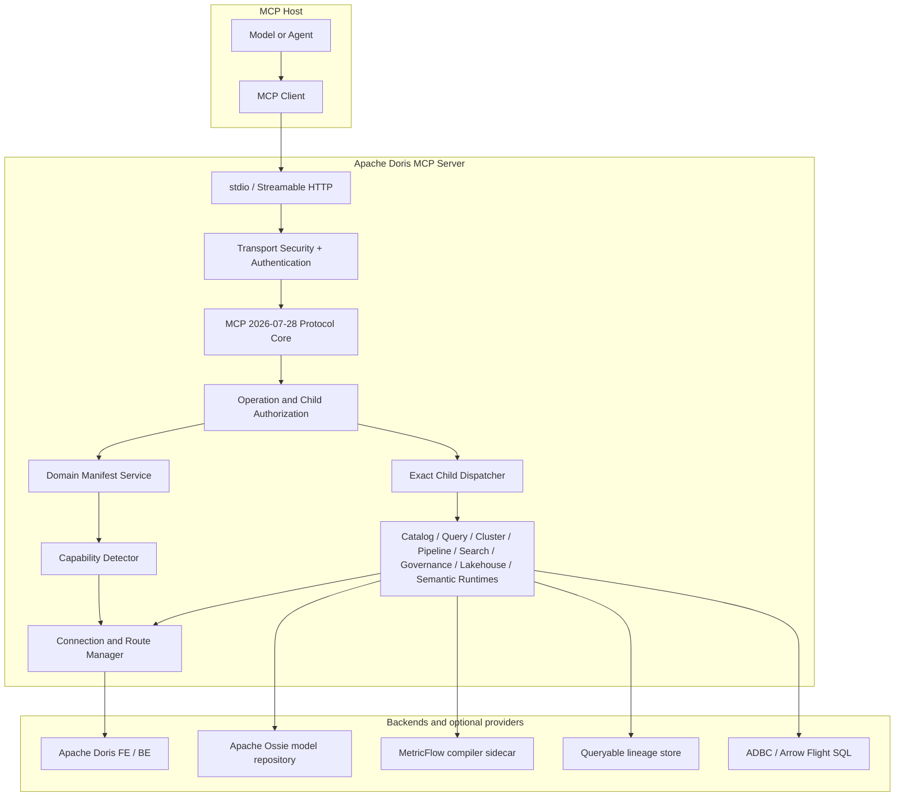

<!--
Licensed to the Apache Software Foundation (ASF) under one
or more contributor license agreements.  See the NOTICE file
distributed with this work for additional information
regarding copyright ownership.  The ASF licenses this file
to you under the Apache License, Version 2.0 (the
"License"); you may not use this file except in compliance
with the License.  You may obtain a copy of the License at

  http://www.apache.org/licenses/LICENSE-2.0

Unless required by applicable law or agreed to in writing,
software distributed under the License is distributed on an
"AS IS" BASIS, WITHOUT WARRANTIES OR CONDITIONS OF ANY
KIND, either express or implied.  See the License for the
specific language governing permissions and limitations
under the License.
-->

# Architecture overview

[English](overview.md) | [简体中文](overview.zh-CN.md)

Apache Doris MCP Server is a read-only MCP control and execution layer for
Apache Doris. It translates a stable MCP contract into authenticated,
capability-aware, bounded Doris operations. It does not replace the Doris SQL
engine, catalog, RBAC system, scheduler, or storage engine.

## Design goals

1. Keep Host registration stable as Doris capabilities grow.
2. Disclose exact child schemas only when a domain is selected.
3. Derive availability from the connected route, not marketing-level version
   assumptions.
4. Preserve deterministic authorization and execution semantics.
5. Keep the built-in contract read-only and bounded.
6. Make degraded behavior, fallbacks, and unsupported states explicit.
7. Use one runtime source of truth for hierarchical and flat exposure.

## Component model

## Responsibility boundaries

### MCP Host and client

The Host owns model context, tool selection, user interaction, and lifecycle
of its MCP connection. It registers eight domain tools in hierarchical mode,
calls a domain with `{}` for discovery, and submits an exact child call. The
Host should cache only within one manifest generation and rediscover after a
stale response.

The Server does not require Host-specific prompt extensions. A compliant Host
can consume the public MCP schemas directly. Host-specific configuration is
limited to transport, credentials, and whether the Host can perform
progressive disclosure.

### Transport and protocol core

stdio and Streamable HTTP converge on one low-level MCP SDK v2 Server. The
protocol layer owns list pagination, input/output Schema enforcement, typed
MCP errors, state handles, trace-context sanitization, and consistent product
identity. It does not contain Doris feature logic.

### Security and policy

Authentication produces a request-scoped identity. Operation policy authorizes
MCP methods and exact domain/child operations. The domain manifest filters
discovery; the dispatcher independently rechecks execution. Doris RBAC then
authorizes actual objects and data. These layers are complementary rather than
substitutes.

### Domain control plane

`DorisDomainCatalog` is the immutable public catalog. `DomainManifestService`
renders bounded authorized manifests. `DomainDispatcher` maps both
hierarchical and flat calls to the same exact child binding and validates
arguments and output. Pre-1.0 tool names are migration inputs only.

### Capability plane

`DorisCapabilityDetector` resolves the request's actual Doris route, parses the
three-part version, runs bounded probes, checks optional providers, and caches
a route-specific snapshot. Manifest availability is derived from this
snapshot and exact permissions. Version alone is never sufficient evidence.

### Execution plane

Each domain runtime accepts structured arguments, validates identifiers and
limits, performs read-only SQL or allowlisted HTTP/provider calls, and returns
normalized structured data. The query runtime is the shared boundary for SQL
shape, parameters, timeout, rows, bytes, masking, and failure classification.

### Apache Doris

Doris remains authoritative for query execution, metadata, catalog
federation, workload state, storage state, audit records, and data permissions.
The MCP Server does not reproduce Doris metadata or authorization as an
independent database.

## Stable two-level tool architecture

The top level answers: **which Doris problem domain does this request belong
to?** The child manifest answers: **which exact operations are authorized and
callable on this route, and what are their schemas?**

This separation avoids three failure modes:

- an ever-growing `tools/list` consuming model context;
- probabilistic Server-side routing selecting the wrong tool;
- static tool documentation claiming a feature is usable when a Doris patch,
  provider, or permission is missing.

Top-level descriptions summarize all child concerns but do not repeat each
parameter. Empty-object discovery is the deliberate progressive-disclosure
step that returns exact child names and schemas.

## Extension boundaries

### Custom tool providers

External business APIs can be added through explicit Python entry points and
the `MCP_TOOL_PROVIDERS` allowlist. Provider tools have their own lifecycle,
schemas, audit metadata, and rate limits. They are not members of the built-in
8/55 contract and cannot shadow built-in names.

### Apache Ossie

The semantic domain consumes reviewed Ossie models for read-only grounding.
Models remain owned by the semantic repository. The Server requires exact
`model_ref` selection and a private Doris binding manifest; it does not guess,
author, compile, or execute semantic expressions.

### MetricFlow

The semantic domain also consumes MetricFlow models through a default-off
sidecar protocol. The provider owns model loading and Doris SQL compilation;
the Server requires an exact `model_ref` and keeps SQL validation, Doris route,
RBAC, execution limits, audit, and results inside `DorisQueryRuntime`. The
provider does not execute Doris SQL.

### ADBC

ADBC is a default-off advanced Query variant, not an automatic query route.
Both ADBC children require explicit end-user ADBC/Arrow Flight SQL intent and
`explicit_adbc=true`; ordinary SQL remains on `execute_query`.

### Native lineage

For Doris 4.0.6 and later, a companion producer may publish canonical events
to a queryable lineage store. The MCP runtime is the consumer/provider layer.
Audit SQL inference is primary before 4.0.6 and an explicit degraded fallback
afterward when native evidence is not usable.

### Administration

`doris_admin` is reserved in architecture contracts but absent from runtime
registration. Read-only domains cannot be upgraded into write operations by
configuration. A future administration release would require a separate
preview/confirm/idempotency/rollback security contract.

## Source layout

| Area | Primary modules |
|---|---|
| Process and transports | `doris_mcp_server/main.py`, `multiworker_app.py` |
| MCP protocol | `doris_mcp_server/protocol.py` |
| Catalog and discovery | `tools/domain_catalog.py`, `domain_manifest.py` |
| Dispatch | `tools/domain_dispatcher.py` |
| Capability detection | `tools/capability_detector.py`, feature/version modules |
| Domain execution | `utils/*_runtime.py` and `tools/tools_manager.py` |
| Authentication and policy | `auth/`, `utils/security.py` |
| Doris routing | `utils/db.py`, `utils/doris_http_client.py` |
| Public configuration | `utils/config.py`, `.env.example` |

## Invariants

- Exactly eight built-in read-only domains and fifty-five built-in children.
- One exact handler and authorization identifier per child.
- One catalog drives hierarchical mode, flat mode, generated docs, and tests.
- No old-name alias window.
- No child execution without current authorization and callable availability.
- No successful result that violates its declared output Schema.
- No write/management operation in the built-in 1.0 surface.

Continue with [Request and data flow](request-lifecycle.md) and
[Capability availability](../capabilities/availability.md).
