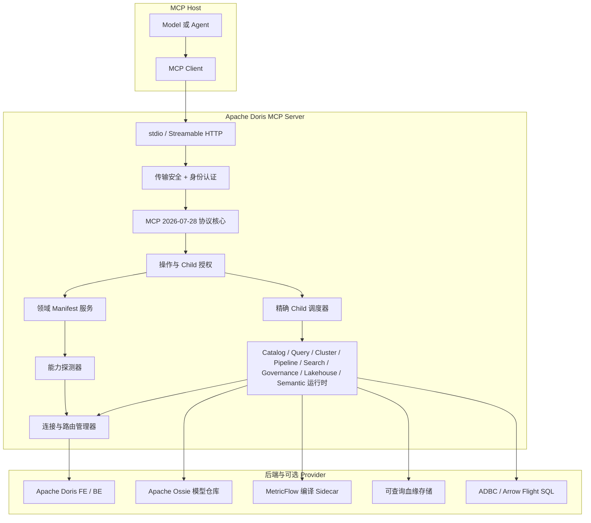

<!--
Licensed to the Apache Software Foundation (ASF) under one
or more contributor license agreements.  See the NOTICE file
distributed with this work for additional information
regarding copyright ownership.  The ASF licenses this file
to you under the Apache License, Version 2.0 (the
"License"); you may not use this file except in compliance
with the License.  You may obtain a copy of the License at

  http://www.apache.org/licenses/LICENSE-2.0

Unless required by applicable law or agreed to in writing,
software distributed under the License is distributed on an
"AS IS" BASIS, WITHOUT WARRANTIES OR CONDITIONS OF ANY
KIND, either express or implied.  See the License for the
specific language governing permissions and limitations
under the License.
-->

# 总体架构

[English](overview.md) | 简体中文

Apache Doris MCP Server 是面向 Apache Doris 的只读 MCP 控制与执行层。它把
稳定 MCP 合同转换成经过身份认证、能力感知且有边界的 Doris 操作。它不会替代
Doris SQL 引擎、Catalog、RBAC、调度器或存储引擎。

## 设计目标

1. Doris 能力持续增长时，Host 注册面仍保持稳定。
2. 只有选中领域后，才披露精确 Child Schema。
3. 基于实际连接路由判断可用性，而不是只看宣传层面的版本特性。
4. 保持确定性的授权与执行语义。
5. 内置合同全部只读且有界。
6. 显式表达降级、回退与未支持状态。
7. Hierarchical 和 Flat 两种暴露模式共用同一个运行时事实源。

## 组件模型

## 职责边界

### MCP Host 与 Client

Host 负责模型上下文、Tool 选择、用户交互和 MCP 连接生命周期。在
Hierarchical 模式下，它注册 8 个领域 Tool，用 `{}` 调用领域完成发现，再提交
一个精确 Child 调用。Host 只能在同一 Manifest 代际内缓存定义，遇到陈旧响应后
必须重新发现。

Server 不要求 Host 增加专有 Prompt。合规 Host 可以直接消费公开 MCP Schema。
Host 侧适配只涉及传输、凭据，以及是否支持渐进披露。

### 传输与协议核心

stdio 和 Streamable HTTP 最终进入同一个 MCP SDK v2 低层 Server。协议层负责
List 分页、输入/输出 Schema、类型化 MCP 错误、状态句柄、Trace Context 清洗和
统一产品身份，不承载 Doris 特性逻辑。

### 安全与策略

认证产生请求级身份。Operation Policy 授权 MCP 方法和精确 Domain/Child 操作。
领域 Manifest 过滤发现，Dispatcher 独立复核执行，最终由 Doris RBAC 决定实际
对象和数据访问。这些层互相补充，不能彼此替代。

### 领域控制面

`DorisDomainCatalog` 是不可变公共目录；`DomainManifestService` 生成有界且经过
授权过滤的 Manifest；`DomainDispatcher` 把 Hierarchical 与 Flat 调用映射到
同一个精确 Child Binding，并校验参数与输出。1.0 以前的 Tool 名称只用于迁移
说明，不是 Alias。

### 能力平面

`DorisCapabilityDetector` 解析请求实际使用的 Doris 路由、提取三位数版本、执行
有界 Probe、检查可选 Provider，并缓存路由级快照。Manifest Availability 来自
该快照与精确权限；仅有版本号不足以证明能力可用。

### 执行平面

每个领域运行时接收结构化参数，校验标识符和上限，执行只读 SQL 或允许的
HTTP/Provider 调用，再返回标准化结构。Query Runtime 是 SQL 形态、参数、超时、
行数、字节数、脱敏和失败分类的共用边界。

### Apache Doris

Doris 对查询执行、元数据、Catalog 联邦、工作负载状态、存储状态、审计记录和
数据权限保持权威。MCP Server 不会另建一套 Doris 元数据或授权数据库。

## 稳定的两级 Tool 架构

一级领域回答：**这个请求属于哪一个 Doris 问题域？** Child Manifest 回答：
**该路由上哪些精确操作有权发现、可调用，它们的 Schema 是什么？**

这种拆分规避三类问题：

- 不断膨胀的 `tools/list` 占用模型上下文；
- Server 采用概率路由而选错 Tool；
- 静态文档在 Doris Patch、Provider 或权限不满足时仍声称功能可用。

顶级 Description 概括完整子域，但不重复每个参数。无参发现是正式的渐进披露
步骤，用来返回 Child 精确名称和 Schema。

## 扩展边界

### 自定义 Tool Provider

外部业务 API 可以通过显式 Python Entry Point 与 `MCP_TOOL_PROVIDERS` Allowlist
接入。Provider Tool 拥有独立生命周期、Schema、审计元数据和限流，不属于内置
8/55 合同，也不能覆盖内置名称。

### Apache Ossie

Semantic 领域消费经过审查的 Ossie 模型进行只读 Grounding。模型仍归语义仓库
管理。Server 要求精确 `model_ref` 和私有 Doris Binding Manifest，不会猜模型、
编写模型、编译或执行语义表达式。

### MetricFlow

Semantic 领域还通过默认关闭的 Sidecar 协议消费 MetricFlow Model。Provider 负责
加载模型和编译 Doris SQL；Server 要求精确 `model_ref`，并把 SQL 校验、Doris
路由、RBAC、执行限额、审计和结果保留在 `DorisQueryRuntime` 内。Provider 不执行
Doris SQL。

### ADBC

ADBC 是默认关闭的高级 Query Variant，不是自动查询路由。两个 ADBC Child 都要求
终端用户明确指定 ADBC/Arrow Flight SQL 并传 `explicit_adbc=true`；普通 SQL
继续使用 `execute_query`。

### 原生血缘

Doris 4.0.6 及更高版本可以由 Companion Producer 把规范事件写入可查询血缘
存储，MCP Runtime 负责消费与对外提供。4.0.6 以前以审计 SQL 推导为主要路径；
4.0.6 以后当原生证据不可用时，它是显式 Degraded 回退。

### 管理能力

`doris_admin` 只存在于架构合同，不进行运行时注册。不能通过配置把只读领域升级
为写操作。未来如果发布管理能力，必须另行设计 Preview、Confirm、Idempotency、
Rollback 等安全合同。

## 源码布局

| 区域 | 主要模块 |
|---|---|
| 进程与传输 | `doris_mcp_server/main.py`、`multiworker_app.py` |
| MCP 协议 | `doris_mcp_server/protocol.py` |
| 目录与发现 | `tools/domain_catalog.py`、`domain_manifest.py` |
| 调度 | `tools/domain_dispatcher.py` |
| 能力探测 | `tools/capability_detector.py` 与版本/特性模块 |
| 领域执行 | `utils/*_runtime.py`、`tools/tools_manager.py` |
| 认证与策略 | `auth/`、`utils/security.py` |
| Doris 路由 | `utils/db.py`、`utils/doris_http_client.py` |
| 公开配置 | `utils/config.py`、`.env.example` |

## 不变量

- 内置能力严格为 8 个只读领域与 55 个 Child。
- 每个 Child 只有一个精确 Handler 与授权标识。
- Hierarchical、Flat、自动生成文档和测试共用同一目录。
- 不保留旧名称 Alias 窗口。
- 没有当前授权和 `callable` Availability 就不能执行 Child。
- 不允许返回违反声明 Output Schema 的成功结果。
- 内置 1.0 工具面不存在写入或管理操作。

继续阅读[请求与数据链路](request-lifecycle.zh-CN.md)和
[能力可用性](../capabilities/availability.zh-CN.md)。
