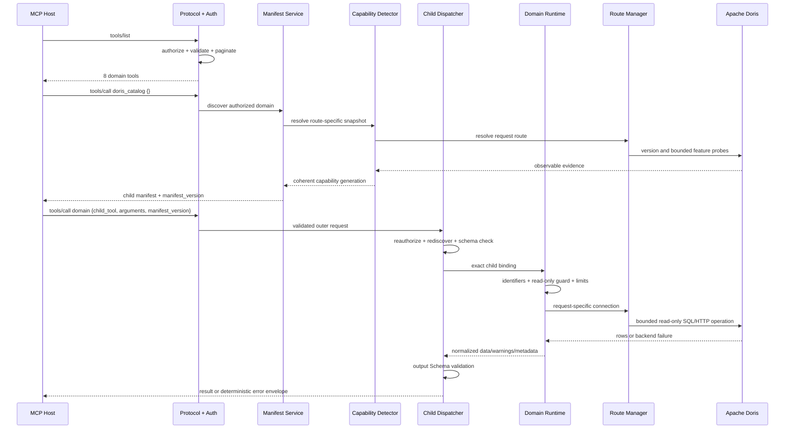

<!--
Licensed to the Apache Software Foundation (ASF) under one
or more contributor license agreements.  See the NOTICE file
distributed with this work for additional information
regarding copyright ownership.  The ASF licenses this file
to you under the Apache License, Version 2.0 (the
"License"); you may not use this file except in compliance
with the License.  You may obtain a copy of the License at

  http://www.apache.org/licenses/LICENSE-2.0

Unless required by applicable law or agreed to in writing,
software distributed under the License is distributed on an
"AS IS" BASIS, WITHOUT WARRANTIES OR CONDITIONS OF ANY
KIND, either express or implied.  See the License for the
specific language governing permissions and limitations
under the License.
-->

# Request and data flow

[English](request-lifecycle.md) | [简体中文](request-lifecycle.zh-CN.md)

This document follows one hierarchical tool call from Server startup through
the MCP Host, capability discovery, Apache Doris, and the final structured
result.

## Sequence



## Phase 1: configuration and startup

1. Environment, file, and CLI inputs are normalized.
2. Incompatible authentication modes, unsafe binds, invalid trusted proxies,
   weak or missing required secrets, unsupported worker shapes, and attempts to
   enable the reserved administration domain fail startup.
3. Security, connection, resource, tool, and prompt managers are constructed.
4. The capability provider and exact child dispatcher are attached to the tool
   manager.
5. stdio or Streamable HTTP binds the same protocol Server.
6. Tools are not dynamically registered per prompt. The chosen exposure mode
   remains stable until process restart.

## Phase 2: top-level `tools/list`

The protocol layer:

- authorizes `list_tools` for the request identity;
- obtains the current public tool list;
- compiles and checks tool schemas against hard budgets;
- adapts the result to the negotiated protocol revision;
- paginates with a signed state handle when needed;
- reports backend/list failures instead of converting them to an empty list.

Hierarchical mode returns eight domains. Flat mode returns authorized formal
children, but each is built from the same current domain manifest and remains
subject to the same size limits.

## Phase 3: authorized domain discovery

An empty object means discovery. The Server resolves children in catalog order:

1. `authorized_child_discovery` removes children the identity may not learn
   about.
2. The capability detector resolves the route selected for this request. A
   static token, Doris OAuth user, or global service account can therefore
   receive different evidence.
3. A base snapshot probes the Doris version and route identity. Domain-specific
   probes are added as needed.
4. Optional provider readiness, mixed-version state, feature ranges, and
   permission visibility are evaluated.
5. Every authorized child receives structured availability. Unavailable
   children are retained with `callable=false`.
6. Descriptions receive a bounded human-readable state prefix; the structured
   availability is authoritative.
7. A deterministic hash of catalog contract, authorized children, capability
   generation, and provider generation becomes `manifest_version`.

One domain discovery uses one coherent capability generation. A provider or
route change during detection cannot mix two generations into one manifest.

## Phase 4: exact child selection

The Host submits:

```json
{
  "child_tool": "execute_query",
  "arguments": {
    "sql": "SELECT 1"
  },
  "manifest_version": "manifest-generation-from-discovery"
}
```

Before backend execution, the dispatcher:

1. resolves one exact domain and child;
2. rechecks discovery authorization;
3. checks the independent exact execution grant;
4. rebuilds the current manifest;
5. rejects a stale requested generation;
6. rejects non-callable availability;
7. resolves one exact handler binding;
8. validates child arguments against the declared JSON Schema.

An unauthorized child is reported as not found. This prevents capability-name
disclosure and avoids treating discovery permission as execution permission.

## Phase 5: read-only execution

The domain runtime applies operation-specific bounds. SQL paths additionally:

- accept only one supported read-only statement shape;
- validate and quote identifiers;
- bind caller values as parameters where supported;
- reject writes, management operations, unsafe stacking, and malformed
  parameters;
- apply configured and absolute ceilings for time, rows, and serialized bytes;
- dispose or invalidate a connection after cancellation/timeout when reuse
  would be unsafe;
- apply configured result masking;
- classify the failure reason and retryability.

The route manager selects Doris OAuth user pool, static-token pool, or global
pool in explicit priority order. SQL and HTTP evidence remain bound to that
same request route.

## Phase 6: result construction

A successful child result contains:

```json
{
  "mode": "result",
  "domain": "doris_query",
  "child_tool": "execute_query",
  "manifest_version": "...",
  "data": {},
  "metadata": {
    "request_id": "...",
    "duration_ms": 12.4,
    "source": "doris_mysql",
    "truncated": false
  },
  "warnings": []
}
```

Warnings identify partial sections, degraded evidence, or truncation without
changing a failure into success. The dispatcher validates normalized data
against the child's output Schema. The protocol layer then sanitizes error
payloads and emits MCP content plus structured content.

## Failure and retry flow

| Condition | Result | Host action |
|---|---|---|
| Unknown or unauthorized child | `CHILD_TOOL_NOT_FOUND` | Do not guess names; rediscover if appropriate |
| Manifest generation changed | `CHILD_MANIFEST_STALE` | Discover the domain again |
| Capability unavailable | `CHILD_CAPABILITY_UNAVAILABLE` | Read `reason_code`; fix version/provider/permission/config |
| Arguments violate schema | `CHILD_ARGUMENTS_INVALID` | Correct exact argument violations |
| Execution timeout | `CHILD_EXECUTION_TIMEOUT` | Reduce scope or retry only when marked retryable |
| Doris/provider failure | `CHILD_EXECUTION_FAILED` | Use reason code and retryability; do not parse raw backend text |
| MCP operation denied | protocol authorization error | Request exact scope or use the correct identity |

## Data classification

The Server processes four different data classes:

- **Public contract data:** domain names, child schemas, availability status,
  stable reason codes, and bounded documentation.
- **Request identity data:** token/JWT/OAuth claims, exact scopes, route
  selection, and principal-bound state. This is request-private.
- **Capability evidence:** versions, probe status, provider generation,
  permission visibility, and route fingerprint. Public output is sanitized and
  bounded.
- **Doris result data:** metadata and query rows authorized by Doris. This is
  bounded, optionally masked, and never cached across incompatible identities.

Continue with [Security and permission model](../security/security-model.md)
and [Reliability and limits](../operations/reliability.md).
