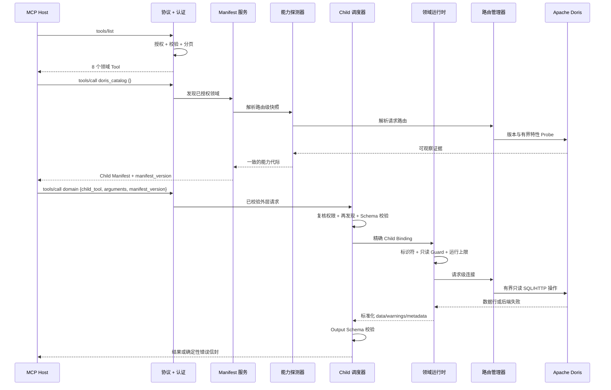

<!--
Licensed to the Apache Software Foundation (ASF) under one
or more contributor license agreements.  See the NOTICE file
distributed with this work for additional information
regarding copyright ownership.  The ASF licenses this file
to you under the Apache License, Version 2.0 (the
"License"); you may not use this file except in compliance
with the License.  You may obtain a copy of the License at

  http://www.apache.org/licenses/LICENSE-2.0

Unless required by applicable law or agreed to in writing,
software distributed under the License is distributed on an
"AS IS" BASIS, WITHOUT WARRANTIES OR CONDITIONS OF ANY
KIND, either express or implied.  See the License for the
specific language governing permissions and limitations
under the License.
-->

# 请求与数据链路

[English](request-lifecycle.md) | 简体中文

本文追踪一个 Hierarchical Tool 调用，从 Server 启动、MCP Host、能力发现、
Apache Doris 一直到最终结构化结果。

## 时序



## 阶段 1：配置与启动

1. 归一化环境变量、配置文件和 CLI 输入。
2. 互斥鉴权、危险绑定、无效可信代理、弱或缺失的必需 Secret、不支持的 Worker
   形态，以及试图启用预留管理领域等情况都会令启动失败。
3. 构造安全、连接、Resource、Tool 和 Prompt 管理器。
4. 将能力 Provider 和精确 Child Dispatcher 接入 Tool Manager。
5. stdio 或 Streamable HTTP 绑定同一个协议 Server。
6. Tool 不会随 Prompt 动态注册；暴露模式在进程重启前保持稳定。

## 阶段 2：顶级 `tools/list`

协议层会：

- 为请求身份授权 `list_tools`；
- 获取当前公开 Tool List；
- 根据硬预算编译并检查 Tool Schema；
- 适配协商后的协议版本；
- 必要时使用签名状态句柄分页；
- 把后端/List 失败明确返回，而不是伪装成空列表。

Hierarchical 模式返回 8 个领域。Flat 模式返回经过授权的正式 Child，但每个定义
同样来自当前领域 Manifest，也受同一大小上限约束。

## 阶段 3：经过授权的领域发现

空对象表示发现。Server 按 Catalog 稳定顺序解析 Child：

1. `authorized_child_discovery` 移除当前身份无权获知的 Child。
2. 能力探测器解析本次请求使用的实际 Doris 路由。静态 Token、Doris OAuth
   用户与全局服务账号因此可能看到不同证据。
3. 基础快照探测 Doris 版本和路由身份，再按需加入领域级 Probe。
4. 评估可选 Provider、混合版本、特性范围和权限可见性。
5. 每个已授权 Child 获得结构化 Availability；不可用 Child 保留为
   `callable=false`。
6. Description 增加有界的人类可读状态前缀，但结构化 Availability 才是权威。
7. Catalog 合同、授权 Child、能力代际和 Provider 代际的确定性 Hash 构成
   `manifest_version`。

一次领域发现只使用同一个能力代际。探测过程中发生 Provider 或路由变化，也不会
把两个代际混入同一 Manifest。

## 阶段 4：精确 Child 选择

Host 提交：

```json
{
  "child_tool": "execute_query",
  "arguments": {
    "sql": "SELECT 1"
  },
  "manifest_version": "发现阶段返回的 Manifest 代际"
}
```

进入后端前，Dispatcher 会：

1. 解析唯一的 Domain 与 Child；
2. 复核发现权限；
3. 检查独立的精确执行权限；
4. 重新构建当前 Manifest；
5. 拒绝陈旧的请求代际；
6. 拒绝不可调用的 Availability；
7. 解析唯一 Handler Binding；
8. 根据声明 JSON Schema 校验 Child 参数。

未授权 Child 以 Not Found 返回，防止泄露能力名称，也避免把发现权限误当成执行
权限。

## 阶段 5：只读执行

领域运行时应用各自上限。SQL 路径还会：

- 只接受一个受支持的只读语句形态；
- 校验并引用标识符；
- 在支持时把调用方值作为参数绑定；
- 拒绝写入、管理操作、堆叠语句和畸形参数；
- 应用配置上限与绝对上限，包括时间、行数和序列化字节数；
- 超时/取消后，如果连接继续复用不安全，就销毁或标记失效；
- 应用配置的结果脱敏；
- 分类失败原因与 Retryability。

路由管理器按明确优先级选择 Doris OAuth 用户池、静态 Token 池或全局连接池。
SQL 与 HTTP 证据必须绑定同一请求路由。

## 阶段 6：结果构建

成功 Child 结果包含：

```json
{
  "mode": "result",
  "domain": "doris_query",
  "child_tool": "execute_query",
  "manifest_version": "...",
  "data": {},
  "metadata": {
    "request_id": "...",
    "duration_ms": 12.4,
    "source": "doris_mysql",
    "truncated": false
  },
  "warnings": []
}
```

Warning 用来表达部分 Section、降级证据或截断，不能把失败改造成成功。Dispatcher
会用 Child Output Schema 校验标准化数据，随后协议层清洗错误并输出 MCP Content
与 Structured Content。

## 失败与重试链路

| 条件 | 结果 | Host 动作 |
|---|---|---|
| 未知或未授权 Child | `CHILD_TOOL_NOT_FOUND` | 不猜名称；必要时重新发现 |
| Manifest 代际变化 | `CHILD_MANIFEST_STALE` | 重新发现领域 |
| 能力不可用 | `CHILD_CAPABILITY_UNAVAILABLE` | 读取 `reason_code`，修复版本/Provider/权限/配置 |
| 参数违反 Schema | `CHILD_ARGUMENTS_INVALID` | 按精确 Violations 修正参数 |
| 执行超时 | `CHILD_EXECUTION_TIMEOUT` | 缩小范围；仅在标记可重试时重试 |
| Doris/Provider 失败 | `CHILD_EXECUTION_FAILED` | 使用原因码与 Retryability，不解析原始后端文本 |
| MCP 操作被拒绝 | 协议授权错误 | 申请精确 Scope 或切换正确身份 |

## 数据分类

Server 会处理四类数据：

- **公共合同数据：** Domain 名称、Child Schema、Availability、稳定原因码和有界
  文档。
- **请求身份数据：** Token/JWT/OAuth Claim、精确 Scope、路由选择和 Principal
  绑定状态；它们只属于当前请求。
- **能力证据：** 版本、Probe 状态、Provider 代际、权限可见性和路由指纹；公开
  输出必须清洗并限界。
- **Doris 结果数据：** Doris 已授权的元数据和查询行；它们有界、可选脱敏，且
  不会跨不兼容身份缓存。

继续阅读[安全与权限模型](../security/security-model.zh-CN.md)与
[可靠性与限制](../operations/reliability.zh-CN.md)。
